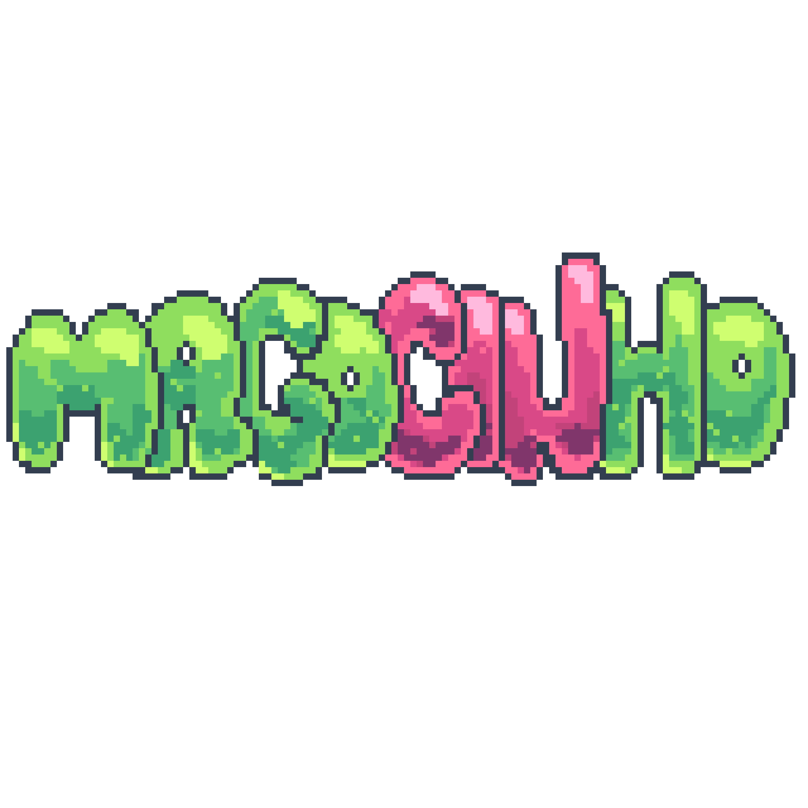

<p align="center">
  
</p>
O jogo acompanha o personagem principal que é o **MagoCINho**, ele é baseado no gnomo Crawly, e o objetivo dele é sobreviver aos guardas, coletar as moedas, poções e cogumelos pelo caminho. Será uma tarefa difícil, pois os inimigos irão persegui-lo até pegá-lo no labirinto.

## Membros e divisão das tarefas
- <strong>Adrielly Alexandre</strong>: Gerência e idealização do projeto; Criação do design do jogo e todas as sprites; Criação de slides para a apresentação; Criação e execução da Tela Inicial; Criação e execução da Tela de Game Over; Implementação da trilha sonora; Apresentação do Slide.
- <strong>Angelina Santos</strong>: Integração da Tela Inicial ao jogo; Integração da Tela Game Over ao jogo; Design para o HUD do jogo; Otimização e integração da inteligência do segundo inimigo.
- <strong>Caio Lopes</strong>: Movimentação do jogador; Moeda e pontuação na tela; Incrementos na classe Item (poção).
- <strong>Gustavo Nogueira</strong>: Inteligência do Inimigo, incrementos na classe Inimigo; Inteligência do segundo inimigo.
- <strong>Luisa Longo</strong>:Movimentação do jogador; Moeda e pontuação na tela; Incrementos na classe Item (poção).
- <strong>Wesley Silveira</strong>: Gerência e idealização do projeto; Criação do esqueleto inicial do programa; Criação do repositório GitHub utilizado; Classe Player; Classe Item; Classe UI; Classe Vértice; Classe Inimigo; Classe Game; Classe Sprites; Apresentação do Slide; Implementação da animação das sprites.

## Arquitetura e organizacão do código
* __config__
> Esse arquivo define as configurações principais do jogo, como dimensões da tela, título, tamanho dos tiles, velocidade dos personagens e FPS. Ele também organiza as camadas de renderização, as direções de movimento do jogador e temporizadores para eventos especiais. Além disso, inclui uma lista do mapa do jogo com caracteres para diferentes terrenos e objetos, centralizando todas as constantes e configurações.
* __inimigo__
> O arquivo define a __classe Inimigo__, que controla os inimigos no jogo. O inimigo é um sprite que se move pelo mapa, tentando seguir o jogador e mudando de direção em vértices. Ele escolhe a direção que o aproxima do jogador, evita repetir caminhos e, se necessário, seleciona outra direção possível. A classe também gerencia a velocidade e a colisão com outros objetos, proporcionando um comportamento funcional e “inteligente” para os inimigos.
* __vertice__
> A __classe Vertice__ representa pontos no mapa do jogo, armazenando sua posição, direções de movimento e um número único. É exibida como uma superfície roxa e ajuda a gerenciar movimento e colisões no jogo.
* __player__
> A __classe Player__ controla o personagem principal, gerenciando sua posição, imagem e velocidade. Ela move o jogador, altera a imagem conforme a direção, e lida com colisões. O jogador perde uma vida se colidir com um inimigo e pode usar poções e cogumelos com teclas específicas para efeitos temporários.
* __main__
> A função principal do jogo é responsável por manter o jogo em execução enquanto o jogador está ativo. Dentro do loop central, ela lida com eventos usando events(), atualiza o estado do jogo com update(), e desenha os elementos na tela com draw(). Esse ciclo continua até que o jogador perca ou complete a fase, garantindo que o jogo flua conforme o FPS configurado.
* __sprites__
> O arquivo sprites.py define várias classes para criar e gerenciar os sprites no jogo: __Classe Block__ que cria blocos que o jogador não pode atravessar, definindo sua posição e tamanho; __classe Chao__ cria o chão onde o jogador pode andar, posicionando a imagem do piso corretamente e definindo seu tamanho; __classe Hitbox__ cria uma área de colisão para o jogador, movendo-se com ele para detectar colisões; __classe HitboxInimigo__ similar à Hitbox, mas para inimigos, atualizando sua posição junto com o inimigo; __classe Barra__ cria uma barra de fundo para mostrar informações ou como parte da interface do usuário; e a __classe Item__ que cria itens que o jogador pode pegar, como moedas, poções e cogumelos.
* __UI__
> A __classe UI__ desenha a interface do usuário no jogo. No método __init__, ela carrega imagens de ícones de itens e corações. O método desenhar_coracao desenha corações vazios e depois os substitui por corações cheios conforme a vida do jogador. E o método display atualiza a tela a cada frame com ícones de itens e corações, posicionando-os nas bordas da tela para mostrar o estado do jogador.

## Capturas de Tela
<div style="display: flex; justify-content: space-around;">
  
  
  
</div>

## Ferramentas, Frameworks e Bibliotecas utilizados
* __Discord /Whatsapp__
> Foram utilizadas essas ferramentas como principal meio de comunicação interna e também com os monitores para realizar as reuniões remotas.
* __Visual Studio Code__
> Utilizado para todo o desenvolvimento do código do jogo devido a sua integração com o GitHub e seus recursos variados.
* __Miro/Notion__
> Foi utilizado como ambiente de trabalho visual para o planejamento inicial da base do jogo.
* __GitHub/ GitHub Desktop__
> Utilizado através da criação de um repositório garantindo a atualização das alterações do código e facilitando o gerenciamento de mudanças no projeto sem perder as alterações anteriores.
* __Pixel Studio/ Photoshop__
> O Pixel Studio foi utilizado para a criação do design de todas as sprites e telas do jogo e o Photoshop foi usado para a edição do tamanho dessas sprites criadas.
* __Pygame__
> Biblioteca de desenvolvimento de jogos em Python, como a principal ferramenta para o desenvolvimento da interface gráfica e da dinâmica do jogo.
* __Random__
> Não é uma biblioteca externa, mas sim um módulo padrão do Python que implementa geradores de elementos aleatórios trazendo a imprevisibilidade e variedade na escolha de algum elemento.
* __os__
> Este módulo fornece uma maneira simples de usar funcionalidades que são dependentes do sistema operacional.
* __Sys__
> Utilizadas em geral para manipular diferentes partes do ambiente de tempo de execução Python, foi utilizado a função ‘exit’, para encerrar o jogo mais rapidamente.
* __Math__
> Biblioteca interna utilizada para executar operações matemáticas simples, como adição, subtração, multiplicação e divisão.

## Conceitos da disciplina aplicados
Os diversos conceitos aprendidos ao decorrer da disciplina foram utilizados durante a produção do jogo ‘MagoCINho’. Cada uma dessas noções foram fundamentais para que os componentes do projeto funcionasse conforme o previsto. Utilizamos **comandos condicionais** e **laços de repetição** para circunstanciar os eventos que devem ocorrer a cada etapa do projeto, as **listas** tiveram finalidades como auxiliar a construção do cenário e dos coletáveis; como também as **tuplas** que estabelecem as cores dos elementos do jogo, por exemplo.
Além disso, o emprego de **funções** favoreceu o desenvolvimento dos objetos das classes, tal qual os estudos sobre **Programação Orientada a Objetos (POO)**, uma exigência do projeto, facilitou a escrita do código, tornando mais fácil o seu entendimento e sua modificação.

## Desafios, Erros e Lições aprendidas
* __Qual foi o maior erro cometido durante o projeto? Como vocês lidaram com ele?__
> O maior erro cometido durante a confecção do projeto foi a falta de organização do tempo no início do trabalho, o que acabou prejudicando um pouco o andamento da construção do jogo. Entretanto, lidamos com isso ao atribuir definitivamente as tarefas de cada integrante do projeto, melhorando a organização interna e o uso do nosso tempo.
* __Qual foi o maior desafio enfrentado durante o projeto? Como vocês lidaram com ele?__
> O maior desafio do projeto foi desenvolver a inteligência do inimigo no jogo. Para superá-lo, realizamos pesquisas aprofundadas e consultamos referências de inteligências criadas para inimigos de outros jogos.
* __Quais as lições aprendidas durante o projeto?__
> Aprendemos a gerenciar nosso tempo de forma mais eficaz em projetos, nos aprofundamos em ferramentas com as quais não tínhamos familiaridade, como Pygame, GitHub, e Notion, além de aprendermos a delegar funções e a colaborar na criação de código em equipe.

## Instruções para execução e instalação
### Certifique-se de ter Python3 e Pygame instalados em seu computador

* Abra o terminal do seu sistema em uma pasta à sua escolha, copie e cole o comando abaixo:

#### Se você usa Windows, execute esse comando:
```
# Clone esse repositório
git clone  https://github.com/sillyveira/magocinho.git
#Entre na pasta do projeto
cd magocinho
#Execute o arquivo 'main.py'
py main.py
```
#### Se você usa MacOS ou Linux, execute esse comando:
```
# Clone esse repositório
git clone  https://github.com/sillyveira/magocinho.git
#Entre na pasta do projeto
cd magocinho
#Execute o arquivo 'main.py'
python3 main.py
```

#
###### _Projeto referente a cadeira de Introdução a Programação do CIN-UFPE no período 2024.1._
